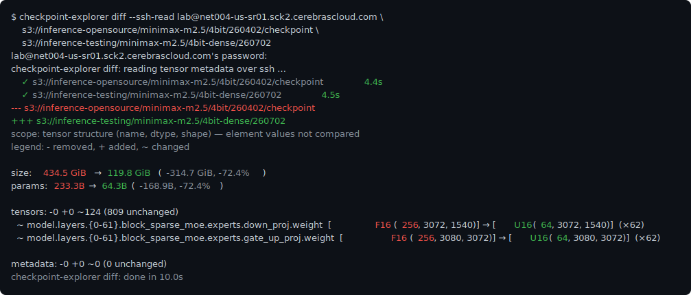

# Checkpoint Explorer

A fast terminal UI for looking **inside** model checkpoints — not just the tree
of tensor names and shapes, but the **actual data**: heatmaps, grids of real
values, histograms, and exact statistics, computed right in your terminal on
tensors of *any* size. It reads [`safetensors`](https://huggingface.co/docs/safetensors),
[GGUF](https://huggingface.co/docs/hub/gguf), NumPy (`.npy` / `.npz`), and (opt-in)
HDF5 (`.h5` / `.hdf5`) checkpoints; decodes **quantized / packed weights** (4-bit,
fused-codebook MoE) so they show their true values; and ships scriptable
[`diff`](#comparing-checkpoints-diff) and [`check`](#checking-checkpoints-check)
subcommands for comparing and health-checking checkpoints.


## Highlights

- 🔬 **See the data, not just the shape.** From any tensor, open an ASCII
  [**heatmap**](#tensor-data-preview), a [**numeric grid**](#tensor-data-preview)
  of real values, a [**value histogram**](#value-histogram-h), and exact
  whole-tensor [**statistics**](#statistics) (min/max, mean, std, % zeros,
  NaN/Inf) — computed by streaming the tensor in bounded blocks, so it works on
  **multi-GB** tensors without loading them into RAM.
- 📊 **The whole checkpoint at a glance.** Press `s` for a
  [**stats popup**](#checkpoint-statistics-s): total params / size, the largest /
  smallest / typical tensor, the dtype mix, and the per-layer and
  per-**MoE-expert** breakdown — including whether experts are stored fused or
  unfused. Header-only, so it's instant even on a many-shard model — plus the
  *true* on-disk footprint from the filesystem (`st_blocks`), so **ZFS/btrfs
  compression and sparse holes** show up, local or over SSH.
- 🧩 **Quantized weights, decoded.** [Reinterpret packed dtypes](#dtype-override)
  on the fly — 4-bit `u4`/`i4` nibbles, or fused-codebook **MoE experts**
  (`unpacked`, e.g. `u3×5`) — so quantized checkpoints show their true values and
  unmerged per-expert shapes instead of raw 16-bit blobs.
- 🗂️ **One tool, every format.** `safetensors`, GGUF, NumPy `.npy`/`.npz`, and
  (opt-in) Cerebras-style **HDF5** — read through a single interface, with
  sharded/multi-file models, directories, and glob patterns merged into one tree.
  (The data views above — heatmap/grid/histogram/stats — cover safetensors,
  NumPy, and HDF5; **GGUF is metadata-only**: its tree, quant types, and metadata.)
- 🔀 **`diff` two checkpoints — local or remote.** A scriptable
  [subcommand](#comparing-checkpoints-diff): structural diff by default
  (`diff`-style exit codes) with a coloured, readable summary — overall size and
  parameter-count change, per-tensor dtype/shape changes, and git-style line diffs
  for metadata — or add `--values`/`--histogram` with name/dtype/shape **filters**
  to compare only the tensors you care about, in parallel even across huge MoE
  checkpoints. Diffs **S3 / MinIO** and remote-SSH checkpoints too (`--ssh-read`),
  so you can compare two deployed checkpoints without downloading either.
- 🩺 **`check` a checkpoint's health.** A scriptable
  [subcommand](#checking-checkpoints-check) (`diff`-style exit codes) that flags
  **truncated / corrupt** safetensors files, **missing layers** or dropped
  shards, index/file mismatches, and dtype/shape oddities — all header-only, so it
  works over `--ssh-read` / S3 — plus a `--values` pass that scans tensor data for
  **NaN/±Inf** and all-zero/constant tensors.
- 🌐 **Built for big & remote.** Loads only metadata (fast startup on huge
  models), and **browses *and* diffs checkpoints on S3 / MinIO** — or any box you
  reach by SSH — whose credentials never leave the server, by delegating the read
  to a remote host (`--ssh-read`, or an scp-style `host:/path`; see
  [Remote checkpoints](#remote-checkpoints-on-s3--minio---ssh-read)). The remote
  access is **strictly read-only** — it can't create, modify, or delete anything
  on the host, so it's safe to point at production checkpoints. Copies to your
  local clipboard over SSH via **OSC 52**, and a `y` key prints the exact CLI
  command to reopen any view — shareable and scriptable.
- 🗜️ **HDF5 repacking.** Losslessly [re-compress](#repacking-hdf5-checkpoints---features-hdf5)
  LZ4 checkpoints with **zstd**/gzip for a smaller on-disk footprint.

Plus the essentials: 🔎 fuzzy search (`/`), 🔢 natural sort for layer numbers
(`layer.2` before `layer.10`), 📏 human-readable sizes (KiB/MiB/GiB), and full
⌨️ keyboard navigation with browser-style back/forward history.

## Installation

### Install
```bash
cargo install --git https://github.com/antont-cerebras/checkpoint-explorer
```

### Prerequisites
- Rust 1.88 or later (the crate uses edition 2024 and let-chains)

### Build from source
```bash
git clone https://github.com/antont-cerebras/checkpoint-explorer
cd checkpoint-explorer
cargo build --release
```

### HDF5 checkpoint support (optional)
Reading Cerebras-style HDF5 checkpoints is behind the `hdf5` feature, which is
off by default so the standard build stays pure-Rust with no system
dependencies. Enabling it bundles and statically links libhdf5 (requires a C
toolchain + `cmake`; the first build is slower):
```bash
cargo install --git <repo-url> --features hdf5
# or from source:
cargo build --release --features hdf5
```

## Usage

### Basic usage
```bash
# Explore a single safetensors file
checkpoint-explorer model.safetensors

# Explore a GGUF file
checkpoint-explorer model.gguf

# Or if building from source
cargo run -- model.safetensors
cargo run -- model.gguf
```

### Directory exploration
```bash
# Explore all safetensors and GGUF files in a directory
checkpoint-explorer /path/to/model/directory

# Recursively search subdirectories
checkpoint-explorer -r /path/to/models

# The tool automatically detects and uses model.safetensors.index.json if present
checkpoint-explorer /path/to/huggingface/model
```

### Multi-file exploration
```bash
# Explore multiple files as a unified model
checkpoint-explorer model-00001-of-00003.safetensors model-00002-of-00003.safetensors model-00003-of-00003.safetensors

# Mix safetensors and GGUF files
checkpoint-explorer model.safetensors model.gguf

# Mix files and directories
checkpoint-explorer model.safetensors /path/to/additional/models
```

### Glob pattern support
```bash
# Use wildcards to select multiple files
checkpoint-explorer *.safetensors

# Match files with specific patterns
checkpoint-explorer model-*.gguf

# Match numbered checkpoint files
checkpoint-explorer checkpoint-[0-9]*.safetensors

# Combine multiple patterns
checkpoint-explorer *.safetensors *.gguf

# Mix glob patterns with explicit paths
checkpoint-explorer model.safetensors checkpoint-*.safetensors
```

### Remote checkpoints over SSH (`--ssh-read`)
Browse a checkpoint that lives only on a remote host — either behind credentials
you (rightly) don't want to copy to your laptop (a Cerebras **cstorch** checkpoint
on MinIO, brokered by a secrets manager), or simply on a box you reach by SSH.
`--ssh-read [USER@]HOST` delegates the read to that host and renders the tree
locally. It handles:
- a **directory of safetensors shards** (or a single `.safetensors` file) at a
  remote path — read over **pure-Rust SFTP** (the tool speaks SSH/SFTP itself, no
  external binary runs locally or on the server). It fetches just each shard's
  header (via the index's `weight_map` + the dir's `*.safetensors`) and parses it
  with the same safetensors parser used for local files. Shards are read **in
  parallel** over a small pool of SSH sessions (the entered password is reused, so
  still one prompt). Host keys are checked against `~/.ssh/known_hosts`; auth uses
  your SSH agent, default keys, or a password / keyboard-interactive prompt.
- an **`s3://…` cstorch checkpoint** — opened **lazily** by a small
  `cerebras.pytorch` script in the remote venv (`source ~/venv/bin/activate` by
  default; point elsewhere with `--ssh-venv /path/to/venv`). This is the one path
  that runs anything remotely (Python/cstorch, over `ssh`), since cstorch/akeyless
  access is the whole point of it.
```bash
checkpoint-explorer --ssh-read lab@usernode \
  /opt/cerebras/inference/models/some-model-4bit                # safetensors dir (SFTP)
checkpoint-explorer --ssh-read lab@usernode \
  s3://inference-testing/some-model/4bit/260504/checkpoint      # s3 cstorch
# scp-style shorthand for a remote safetensors dir (no --ssh-read needed):
checkpoint-explorer usernode:/opt/cerebras/inference/models/some-model-4bit
```
**Nothing but the header metadata leaves the server** — no keys, no tensor data.

> **Read-only, guaranteed.** `--ssh-read` never modifies the remote checkpoint.
> Files are opened strictly read-only (`OpenFlags::READ` — no create/write/
> truncate), the tool issues no `mkdir`/`remove`/`rename`/`chmod`, and the `s3://`
> path only *loads* the checkpoint and prints metadata to stdout (no
> `save`/write). So it's safe to point at production checkpoints — it cannot
> accidentally alter or delete anything on the host.

This is **metadata-only** (structure + dtype + shape) — flagged by a
`metadata-only` badge on the tree's status line (beside the read-only / health
badges; hover it for the why). The data views (heatmap / numeric grid / histogram
/ statistics) need the bytes locally, so copy the checkpoint down to preview its
values. `diff` takes `--ssh-read` too, for a
structural (dtype/shape) comparison of two remote checkpoints:
```bash
checkpoint-explorer diff --ssh-read lab@usernode /opt/…/model-a /opt/…/model-b
```
(The two checkpoints are read **in parallel** — any mix of `s3://` and safetensors
dirs — each with its own colour progress spinner and elapsed timer. The password
is entered once and reused for the second connection, so you're still prompted only
once.)

### Open a tensor directly
Jump straight to a tensor's preview on startup instead of navigating the tree —
handy for scripting or revisiting a known tensor:
```bash
# Open a tensor's detail screen
checkpoint-explorer model.hdf5 --tensor model.layers.0.mlp.down_proj.weight

# Open straight into the numeric values grid, reinterpreted as packed 4-bit,
# in the first/last edges submode
checkpoint-explorer model.hdf5 \
  --tensor model.layers.0.block_sparse_moe.experts.down_proj.weight \
  --dtype u4 --values --edge

# --tensor is optional when the checkpoint holds a single tensor (always so for
# a .npy): reshape a flat dump and view it as packed 4-bit, no name needed
checkpoint-explorer weights.npy --shape 128,3088,2992 --dtype u4 --values
```
The flags below act on the opened tensor. `--tensor` names it (exact name), but
is **optional when the checkpoint has only one tensor** — always the case for a
`.npy`, and for a single-array `.npz`/HDF5/safetensors; with several, a view flag
without `--tensor` is reported as ambiguous.

| Flag | Effect |
|------|--------|
| `--tensor <NAME>` | Open this tensor (exact name); optional for single-tensor checkpoints |
| `--metadata <NAME>` | Reveal a metadata entry in the tree (exact name, e.g. `model.norm.weight.__metadata__`) |
| `--values` / `--heatmap` | Open the numeric grid / the heatmap (default: the detail screen) |
| `--histogram` | Show the value histogram on the detail screen |
| `--bins <N>` | Histogram bucket count (1–512); implies `--histogram` |
| `--tree` | Reveal the tensor highlighted in the tree browser, without opening a view |
| `--tree-state <expanded\|collapsed>` | Open the tree fully expanded / collapsed (the `E` / `C` keys) |
| `--search <QUERY>` | Open the tree in search mode filtered to QUERY (the `/` key) |
| `--legend` | Overlay the opened screen's legend (the `l` key); most useful with `--plain` |
| `--health` | Open straight into the health-check popup on the tree (the `h` key) |
| `--health-findings` | Like `--health`, but with the per-finding detail expanded (the popup's `f` toggle) |
| `--stats` | Open straight into the checkpoint-stats popup on the tree (the `s` key) |
| `--stats-shards` | Like `--stats`, but with the on-disk per-shard breakdown expanded (the popup's `f` toggle) |
| `--dtype <DTYPE>` | Reinterpret the dtype: `u4`, `i4`, `unpacked` (fused-codebook unmerge; needs a packing schema), or `f16`/`bf16`/`i16`/`u16`/`f32`/`i32`/`u32`/`f64`/`i64`/`u64`/`i8`/`u8`/`stored` |
| `--shape <DIMS>` | Reinterpret the shape (same element count): `10,100` / `10x100`; one dim may be `-1`/`*`/`_` to infer |
| `--edge[=RFRAC,CFRAC]` (alias `--edges`) / `--overview` / `--window[=ROW,COL]` | Force the edges submode (optional head/tail split fractions `0..1`) / the overview / the contiguous window (optional top-left `ROW,COL`) |
| `--zebra <rows\|cols\|off>` | Zebra-stripe the numeric grid by rows, columns, or off |
| `--base <dec\|hex\|oct\|bin>` | Numeral base for the numeric grid; non-decimal shows each element's raw stored bits |
| `--slice <INDEX>` | Starting slice for a 3D tensor: an index (`12`) or a percentage (`50%`) |
| `--compute-stats` | Start the statistics scan immediately on the detail view (data views always compute them) |
| `--exit` | Render the requested view once and exit, without entering interactive navigation |

Dismissing the opened screen drops you into the normal tree browser, so you can
keep exploring.

### Export the tree or tensor list (scripting)
Print the checkpoint structure to stdout and exit — for piping into `grep` /
`jq` or saving to a file — instead of opening the browser. `--print-tree` dumps
the grouped tree (fully expanded, the same text the `t` key copies);
`--print-tensors` a flat list of every tensor. Both default to plain text and
accept `--format json`; add `-v` for per-tensor detail. Output is pipe-safe
(closing the pipe, e.g. `| head`, exits cleanly).

```bash
# The whole tree as text, fully expanded
checkpoint-explorer model.safetensors --print-tree

# A flat, one-per-line list of every tensor (natural-sorted)
checkpoint-explorer shards/ --print-tensors

# A model.safetensors.index.json-style object: metadata.total_size + a
# weight_map of tensor name -> shard file
checkpoint-explorer shards/ --print-tree --format json

# -v adds detail: the source file in text; a `tensors` block (dtype/shape/
# element count, plus codec + on-disk size for compressed tensors) in JSON
checkpoint-explorer model.safetensors --print-tensors --format json -v

# Works over SSH too — only the structure crosses the wire
checkpoint-explorer host:/opt/model --print-tree --format json

# Filter by a name glob (repeatable); prefix ! to exclude
checkpoint-explorer model.safetensors --print-tree --name '*.mlp.*'
checkpoint-explorer model.safetensors --print-tensors --name '!*.bias'
```

| Flag | Effect |
|------|--------|
| `--print-tree` | Print the grouped tree (fully expanded) and exit |
| `--print-tensors` | Print a flat list of every tensor and exit |
| `--format <text\|json>` | Output format for the above (default `text`) |
| `-v` / `--verbose` | Add per-tensor detail (source file in text; a `tensors` block / detail objects — dtype, shape, element count, and codec + on-disk size for compressed tensors — in JSON) |
| `--name <GLOB>` | Restrict the printed tree/list to matching tensor names (repeatable; prefix `!` to exclude, e.g. `'!*.bias'` = everything but biases) |

### Keyboard Controls

Every shortcut shown in the footer is also a **clickable button** — click it to
run the action, or **hover it with the mouse to pop up a help bubble** explaining
what it does (handy while you're still learning the keys).

| Key | Action |
|-----|--------|
| `↑` / `↓` | Navigate up/down through the tree |
| `←` | Jump to the parent group |
| `→` | Enter the group (expand if needed) and select its first child |
| `Shift`+`↑` / `Shift`+`↓` | Jump to the previous / next sibling |
| `Enter` | Expand/collapse the group, or open the tensor's details |
| `Space` / `:` | Open the **command palette** — fuzzy-search and run any command (VS Code style, grouped `Copy: File path`, `View: Stats`, …) |
| `E` / `C` | Expand all / collapse all groups |
| `/` | Enter search mode to filter tensors |
| `l` | Show a legend explaining the symbols on the current screen (works on every screen) |
| `c` | Copy the current screen's text to the clipboard (works on every screen) |
| `t` | (Tree) open a menu to copy the tree or a flat tensor list — text or JSON, plain or verbose (every `--print-*` variant) — to the clipboard |
| `f` | Copy the selected row's File path (tensor file, or a group/root's file or directory) |
| `n` | Copy the selected tensor's Name to the clipboard |
| `y` | Show and copy the CLI command that reopens this exact screen — file, tensor (or metadata entry), dtype/shape overrides, view, layout, zebra, base, slice (works on every screen) |
| `s` | **Detail screen:** compute the tensor's statistics on demand · **Tree:** float the [checkpoint-stats popup](#checkpoint-statistics-s) — per-file / per-tensor sizes, params, the dtype mix, and the per-layer / per-expert breakdown; `f` folds/unfolds the on-disk per-shard list, `r` copies the report, `c` the screen, `y` the reopen command (`--stats`) |
| `h` | **Detail screen:** show the value histogram · **Tree:** run the health checks and float the report in a popup — `f` folds/unfolds the per-finding detail (folded by default), `v` runs the value-tier data scan (progress bar; `Esc` cancels), `r` copies the report, `c` the screen, `y` the reopen command (`--health`); same checks as the [`check`](#checking-checkpoints-check) subcommand (auto-suggested when an index/file mismatch is detected) |
| `R` | Repack the current HDF5 checkpoint into a new file (HDF5 only) |
| `Backspace` / `\` | Step **back** / **forward** through the screens you've visited (browser-style history) — e.g. reopen a view you just left |
| `Esc` | Exit search mode |
| `q` | Quit the application (or exit search mode if active) |
| `Ctrl+C` | Force quit |

`Backspace` and `\` move through a history of the screens you've been on (the
tree, a tensor's detail, and its data views), so if you leave a screen by a
stray key you can step right back to it — and forward again. (While the tree's
search box is active, `Backspace` edits the query instead.)

`c` copies the **text of the current screen** to the clipboard — the tree
listing, a tensor's detail, or a data view's grid — via the OSC 52 terminal
escape, so it reaches your local clipboard even over SSH/tmux (when the terminal
supports it). `t` (in the tree) opens a small menu to copy the **whole
checkpoint** rather than just the visible screen — pick the tree or a flat
tensor list, as text or JSON, plain or verbose (every `--print-*` variant; see
[Export the tree or tensor list](#export-the-tree-or-tensor-list-scripting)).
If the chosen export is too large for the terminal's clipboard, `t` instead
copies the exact CLI command that reproduces it and shows it, so you can run
that to export it.
A status bar pinned to the bottom of the tree shows the file the
selected tensor lives in (or, for a group/root, the single file or the shared
directory of its tensors); `f` copies that path (so copying the root yields the
file or the checkpoint directory).

`y` shows — and copies — the **CLI command that reopens the current screen** with
its precise settings: the file and `--tensor`, any active `--dtype` / `--shape`
override, the view (`--values` / `--heatmap`), the layout *and its position* (the
window's top-left corner via `--window=ROW,COL`, or the edges head/tail split via
`--edge=RFRAC,CFRAC`), the `--zebra` mode, the `--base`, and the `--slice`. So a
panned window or a re-balanced edges view round-trips exactly. On the tree it reproduces the
*highlighted tensor* — `--tensor … --tree`, which reopens the tree with that
tensor revealed (e.g. after backing out of its view) rather than opening it.
Paste it to share or revisit an exact view; append `--exit` to render it once
and drop back to the shell.

### Search Feature

Press `/` to enter search mode and start typing to filter tensors by name. The search:
- Uses **fuzzy matching** - find tensors even with typos or partial matches (e.g., "attnproj" will match "attn.c_proj.weight")
- Searches **all tensors** - not just visible ones, regardless of collapsed groups
- Shows results in a **flat list** with full tensor names
- Sorts by **relevance** - best matches appear first

Press `Enter` to open the highlighted result's details (you stay in search), and `Esc` or `q` to exit search mode and return to the full tree view.

### Tensor data preview

From a tensor's detail screen (open it with `Enter`), you can preview the
actual data of 1D/2D/3D tensors. Size-1 dimensions are ignored when counting
those, so a tensor stored as e.g. `(128, 3088, 1, 748)` previews as the 3D
`(128, 3088, 748)` it effectively is:

- `m` — an **ASCII heatmap**: each sampled element is a colored block on a
  blue→green→red scale, with a min/max legend. Each character row packs two
  data rows (upper/lower half-block) for higher vertical resolution.
- `v` — a **numeric grid** of sampled values with row/column indices, including
  the edges. Column width adapts to the *actual* values (from the exact stats),
  so a tensor of small numbers packs many more columns onto the screen — even a
  16-bit dtype whose values happen to be one- or two-digit (common for sparse /
  quantized formats) gets as many columns as a 4-bit view, instead of always
  reserving room for `-32768`. Floats use a fixed scientific-notation width.
  When an index label is wider than its (narrow) cell, the labels are staggered
  across two header rows ("leap-frog"), and — for the most extreme cases —
  thinned so the ones shown don't collide. To make the grid easier on the eyes
  the indices are dimmed and the cells get a subtle alternating "zebra"
  background (a constant-width band per row or column); `z` cycles the striping
  between rows, columns, and off. `b` cycles the **numeral base** — decimal
  (the default), hex, octal, or binary; the non-decimal bases print each
  element's raw stored bit pattern, zero-padded to the dtype's width (e.g. an
  `F32` as 8 hex digits, a `BF16` as 4), which is handy for inspecting exact
  bits, NaN/inf patterns, or quantized payloads.

Both views open in the **edges view** by default — the first *and* last rows and
columns (as many as fit), with a dotted `⋯` / `⋮` separator marking the skipped
middle — handy for seeing how a tensor is padded at its edges (e.g. zero padding
vs. something else). Press `e` to cycle the layout: **overview** (evenly-spaced)
→ **edges** → **window** → back to overview.
In the edges view the **arrow keys move the divider** between the first
and last blocks: `←` / `→` slide the column divider (so `→` grows the first
columns and shrinks the last, `←` the reverse), `↑` / `↓` slide the row divider,
and holding `Shift` pushes it all the way to one end (e.g. `Shift`+`←` to see
only the last columns). The header shows the current split (e.g.
`first 8 & last 18`). The layout choice and the split are remembered for the
session, so they stick as you move between tensors.

The **window** layout shows a contiguous block of the *actual* neighbouring
values (no downsampling) that you pan around with the **arrow keys**: a plain
arrow moves one row/column and `Shift`+arrow strides a whole screenful. To jump
straight to an edge, `Home` / `End` go to the first / last column and `PageUp` /
`PageDown` to the first / last row (`Ctrl`+arrow does the same on terminals that
send it). The header shows the visible range (e.g. `window: rows 120–179 of
3088`). The pan position is remembered for the session and clamped to stay in
bounds.

For **3D tensors** (e.g. stacked MoE experts, shape `[experts, rows, cols]`) the
preview shows a 2D matrix at a fixed leading index — the 0th by default. The
`←` / `→` arrows step through the slices one at a time and `Shift`+`←` / `→` jump
~5% at a time (both wrap around at the ends); `/` prompts for a slice to jump to —
either an exact index or a percentage like `50%` (0% = first, 100% = last).
Out-of-range entries are rejected with a message rather than jumping. (In the
edges and window layouts the arrows are claimed by the divider / panning, so
there slices step with `[` / `]` — `/` still works.)
Within either view, `m` and `v` switch between the heatmap and numeric
representations in place, `e` cycles the layout (overview → edges → window), and
`Ctrl+C` quits the app from anywhere.

#### Value histogram (`h`)

On the **detail screen**, `h` computes a whole-tensor **value histogram** and
shows it inline below the statistics — a horizontal ASCII bar chart, one bar per
bin, each with its absolute count and percentage of the finite values. The bars
fill in live as the tensor is scanned (any key cancels). Small-integer encodings
get one bar per possible value — e.g. a `u4` view shows all 16 values `0..15`,
including ones absent from the data. Integers with a wider range are grouped into
whole-number-width bins (the bucket edges stay integers, never fractional), and
floats use equal-width range bins across the value range. It respects the active
`--dtype` reinterpretation, so a `u4` view histograms the unpacked 4-bit values.

Press `b` (or pass `--bins N`, 1–512) to set the bucket count — it applies to the
float and wide-integer cases (the small-integer encodings are intrinsically one
bar per value); an empty entry returns to the automatic count. Results are
cached, and `y` includes `--histogram` (and `--bins N` when set) so the view
round-trips.

#### Statistics

The heatmap/numeric views show **exact whole-tensor statistics** — value range,
mean, standard deviation, % zeros (sparsity) and a non-finite (NaN/Inf) count —
computed by scanning every element once (`safetensors` are memory-mapped and
decoded in parallel with `rayon`; HDF5 datasets are streamed in row-blocks so
memory stays bounded regardless of tensor size — including LZ4-compressed
Cerebras checkpoints, which are decompressed in-process). The heatmap's color
scale uses the exact range, so colors mean the same thing across slices. The
detail screen shows the same stats on demand: press `s` to compute them (so
browsing the tree stays fast). Results are cached per tensor (and per dtype
override) for the session, and the scan time is shown dimmed next to the stats.
Scanning a multi-GB tensor takes a moment the first time (it's largely
disk/NFS-bound); the scan runs on a worker thread with an animated spinner, a
progress bar (the fraction scanned so far) and a running timer. In the
heatmap/numeric views the scan stays **out of your way** —
you can keep switching the layout (overview / edges / window), panning, stepping
slices, and reinterpreting the dtype while it computes; the values are shown from
the sampled range until the exact stats land. Switching the dtype restarts the
scan for the new view. Leaving the view cancels it. (On the detail screen, where
there's nothing else to do, any key cancels the scan; `Ctrl+C` always quits.)

**Preloading.** Opening a tensor's detail screen starts computing its statistics
in the background, shown live on the *Statistics* line with a spinner, a progress
bar and a timer (instead of waiting for you to press `s`). The scan streams the tensor in bounded
blocks — never holding more than one block, so memory stays flat even for a
multi-gigabyte tensor — and reading every block warms the OS/disk cache (the
dominant cost over NFS) as a side effect. So by the time you open the
heatmap/numeric view the stats are ready and the data is already warm, and only
the small result is kept. The scan is cancelled the moment you leave the detail
screen, so it never competes with the interactive view, and whatever it read
stays warm in the cache. Disable it with `--no-preload` (then statistics are
computed only when you press `s`).

Both views also sample a grid that fits the screen (they never read the whole
tensor for the *display* — only each sampled row's column span). Both the
statistics and the data preview work for `safetensors`, NumPy (`.npy` / `.npz`),
and HDF5 (`--features hdf5`) of any size, reached through one format-agnostic
reader; GGUF data preview is not yet supported.

NumPy `.npy` files hold a single array (named after the file); `.npz` archives
expose each member array by name, and compressed archives
(`np.savez_compressed`) are decompressed on demand. Fortran-ordered arrays are
read correctly but shown transposed (their dimensions reversed).

#### Checkpoint statistics (`s`)

The per-tensor stats above answer "what's *in* this tensor?"; press `s` on the
**tree** for the complementary question — "what *is* this checkpoint?" — as a
popup summarising the whole model at a glance:

- **Overview** — the architecture (`model_type` from `config.json`, when
  present), total parameters, and total size (on-disk vs. logical, with the
  compression ratio for compressed HDF5).
- **Files** — how many shards, and the largest / smallest / average / median
  shard size, so an unbalanced split stands out.
- **Tensors** — the tensor count, plus the largest and smallest tensor (named)
  and the average / median size, so an outlier stands out.
- **Layers** — the repeated `…layers.<i>.…` stack: how many layers, and the
  parameters / bytes in each (and in total).
- **Experts (MoE)** — for mixture-of-experts checkpoints: experts per layer,
  whether they're stored **fused** (stacked into one tensor per projection) or
  **unfused** (a tensor per expert) — and whether gate & up are fused — plus the
  parameters / bytes in a single expert, the same way layers are broken down.
- **By dtype** — the dtype mix, each with its tensor count and byte share, so a
  quantized / mixed-precision checkpoint shows exactly how much is in each type.
- **On disk (filesystem)** — the *true* footprint from the OS (`st_blocks`),
  overall and per shard. Unlike every count above (which is logical: shape ×
  dtype), this reflects **filesystem compression (ZFS/btrfs) and sparse-file
  holes** — so a mostly-zero checkpoint that squashes on ZFS shows its real disk
  usage. The per-shard list is **folded by default** to a one-line summary
  (`N of M smaller`); press `f`, or click the row, to expand it to **every**
  shard's apparent → allocated size. For `--ssh-read` dirs it's measured by a single
  read-only `stat` on the remote host (SFTP carries no block count); it's omitted
  for `s3://` and in the deterministic `--plain` render (a live measurement isn't
  reproducible).

It's derived from the metadata already in memory (shapes and dtypes, no data
read), so it's instant even on a multi-GB, multi-shard checkpoint. The body
scrolls (`↑`/`↓`, `PgUp`/`PgDn`, `Home`/`End`, wheel) when it's taller than the
popup; `f` folds/unfolds the per-shard list, `r` copies the report as plain text,
`c` copies the screen, `y` copies the command that reopens it (`--stats`, or
`--stats-shards` when the list is expanded), and `Esc` or a click dismisses.

#### Dtype override

When the stored dtype misrepresents the data — common for quantized checkpoints
where 4-bit weights are packed into a `bf16`/`f16`/`i16` slot — press `d`
(safetensors or HDF5) to open a menu of alternative interpretations, just for
visualization. It reinterprets the raw stored bytes, so for HDF5 it applies to
both the statistics and (for previewable sizes) the data views.
This works from both the tensor **detail** screen and the heatmap/numeric views;
the detail screen updates its dtype, shape and parameter count to match. The menu
previews each option live as you move through it (`←`/`→` or `d`/`D` to move,
`Enter` to apply, `Esc` to cancel); the choice is remembered per tensor until you
quit. Options for a 16-bit tensor:

- another **same-width** dtype, e.g. view a `BF16` tensor as `F16` / `I16` / `U16`;
- **`u4`/`i4`** — quantized 4-bit weights stored inside a wider container, with
  every nibble unpacked densely, so each 16-bit slot yields four values and the
  last dimension grows ×4 (`i4` sign-extends two's-complement nibbles).
- **`unpacked`** — a fused-MoE codebook weight whose `U16` words pack several
  experts' sub-byte indices, described by a per-tensor **quantization schema**
  (`bit_widths`, e.g. `[4,4,4,4]` or `[3,3,3,3,3]`, even non-uniform). The view
  *unmerges* the schema along the **first (expert) dimension** — each logical
  expert is one field shifted out of the word — so the expert count grows by
  `lenP` (e.g. `(26, 2057, 770)` → `(130, 2057, 770)` for `u3×5`) and each expert
  reads as a correct 2D slice. Stepping the slice (`[`/`]`, `←`/`→`) walks the
  experts. This option appears, and is applied by default, only for tensors that
  carry a schema (read from the per-tensor `…__metadata__` or a top-level
  `codebook_packing_schema`); `d` / `--dtype stored` switches back to the raw `U16`.

The header shows the active reinterpretation (e.g. `BF16 as u4`, or
`U16 as u3×5 (unpacked)` with a `Packing:` line listing the bit widths).

#### Shape override

Press `r` (or `--shape`) to **reinterpret the dimensions** — handy for a flat
array dumped without structure, or to fold a tensor into a more readable grid.
Enter dimensions separated by `,`, space, or `x` (e.g. `10, 100` / `10x100`);
the product must equal the tensor's element count, and one dimension may be a
wildcard (`-1`, `*`, or `_`) that's inferred from the rest, like NumPy's
`reshape(-1, …)`. An empty entry clears the override. The data isn't moved — any
reshape with a matching element count is a valid row-major reinterpretation — and
it composes with the dtype override (which then expands the new last dimension).
The header shows it against the stored shape, e.g. `(1182629888) as (128, 3088, 748)`.

### Repacking HDF5 checkpoints (`--features hdf5`)

Cerebras-style HDF5 checkpoints compress their chunks with LZ4, which — being
byte-oriented with no entropy coding — only reaches ~2× on quantized weights
(e.g. 4-bit values packed into 16-bit words). **Repacking** rewrites the file
with an entropy-coding codec, recovering that win, with the data preserved
exactly (same dtype, shape and chunking).

You choose the **codec** and the streaming **buffer size**:

- `gzip` (DEFLATE) — built in; ~3.5× on 4-bit weights, but slower.
- `zstd` — best ratio with fast decode (registered in-process; the output is
  also readable by `h5py` + `hdf5plugin`).
- `lz4` — the format these checkpoints ship with: fast, but only ~2×.
- `none` — store uncompressed.

From the main tree screen press `R`: it asks for the output filename (pre-filled
with `<name>.repacked.hdf5`), then the codec, then the buffer size, and shows a
progress bar while it streams each dataset across.

The same is available non-interactively:

```bash
# Repack with zstd (default level), 256 MiB streaming buffer
checkpoint-explorer convert --codec zstd model.hdf5 model.zst.hdf5

# Pick a level (gzip 0–9, zstd 1–22), a 1 GiB buffer, and allow overwriting
checkpoint-explorer convert -c gzip -l 9 -b 1G -f model.hdf5 model.gz.hdf5
```

Datasets are streamed in bounded row-blocks sized to the buffer, so memory stays
low regardless of tensor size (a larger buffer just means fewer, bigger reads).
On completion it reports how the on-disk size changed — e.g.
`39 datasets · on disk 8.2 GiB (lz4) → 5.3 GiB (zstd): 35% smaller (1.56×)`. It
refuses to write over its own input, and warns if the chosen codec is the one
the source already uses (a re-encode, where a plain copy would do).

### Comparing checkpoints (`diff`)

```bash
# Structural diff: which tensors (name/dtype/shape) and metadata were added,
# removed, or changed. Fast — tensor data is not read. Exit 0 = identical,
# 1 = differences, 2 = trouble (like the `diff` utility).
checkpoint-explorer diff old.safetensors new.safetensors

# Also compare element values (not just dtype/shape): promotes a values-only
# change to a difference and reports max/mean |Δ|. Reads the data.
checkpoint-explorer diff old.safetensors new.safetensors --values
```

A remote structural diff of two `s3://` cstorch checkpoints — read over a single
SSH session (one password prompt), rendered in colour (old **red**, new **green**,
secondary detail dimmed):



**Comparing a subset of tensors.** Any of the filters below scopes the whole
diff (structural *and* `--values`/`--histogram`) to the matching tensors, so you
only read and compare what you care about. They **compose with AND** — a tensor
is kept only if it matches every filter given — and metadata isn't compared in a
filtered run (a note says so). Names, dtypes, and shapes all use the same glob
engine (`*`, `**`, `?`, `[…]`):

| Flag | Selects |
|------|---------|
| `--name <GLOB>` | Tensors whose name matches the glob, e.g. `'*.mlp.down_proj.weight'`, `'model.layers.*'`. Repeatable — matches ANY given; prefix `!` to exclude (`'!*.bias'` = everything but biases). |
| `--names <A,B,C>` | Exact names (comma-separated). |
| `--names-from <FILE>` | Exact names from a file (one per line; `#` comments allowed). |
| `--dtype-is <GLOB>` | Tensors whose stored dtype matches, e.g. `BF16`, `'F*'` (F16/F32/…). Case-insensitive; matches either side, so it catches a dtype change. |
| `--shape-is <DIMS>` | Tensors whose shape matches. Dims are comma- or `x`-separated; `*` wildcards **one** dimension and `**` **any number** — e.g. `768,2048`, `768,*`, `*,2048`, `768,**`, `**,2048`. |

```bash
# Value-compare just the down_proj weights across every layer
checkpoint-explorer diff old/ new/ --values --name '*.down_proj.weight'

# Only the BF16 tensors whose shape ends in 2048
checkpoint-explorer diff old/ new/ --dtype-is BF16 --shape-is '**,2048'

# A specific set of tensors listed in a file
checkpoint-explorer diff old/ new/ --values --names-from tensors.txt
```

With a filter active, a line on **stderr** reports how many tensors matched (of
the total) and the matched names collapsed into their index-templated schema, so
it's clear which layers / experts were covered:

```
filter [name~*_proj.weight] matched 18624 of 31251 tensor(s):
    model.layers.{0-47}.mlp.experts.{0-127}.down_proj.weight  (×6144)
    ...
```

**Reconciling different naming schemes (`--map`).** When two checkpoints are the
same model under **different tensor names** — a common case across export
pipelines — a plain diff is a useless wall of "everything removed + everything
added". A rename rule rewrites the **old** (left) checkpoint's names into the
new one's scheme *before* comparing, so corresponding tensors line up and you see
the real deltas (dtype / shape / count) instead. Each rule is a regex →
replacement (`REGEX=>REPLACEMENT`, `$1` for captures), applied in order — so one
rule can rewrite a shared segment across every layer at once:

```bash
# gpt-oss (mlp.experts) vs a block_sparse_moe-named checkpoint
checkpoint-explorer diff old/ new/ \
  --map '\.mlp\.experts\.=>.block_sparse_moe.experts.' \
  --map 'experts\.(down|gate_up)_proj$=>experts.${1}_proj.weight'

# Or load the rules from a file (merged after any --map). A '.json' file is a
# JSON array of [pattern, replacement] pairs; any other extension is one
# 'REGEX=>REPLACEMENT' rule per line ('#' comments and blank lines ignored).
checkpoint-explorer diff old/ new/ --map-from rename.txt
```

A note on **stderr** reports how many rules were applied; if a rule is broad
enough to map two tensors onto one name, that collision is warned about (the last
wins). `--map` is a whole-checkpoint concern, so it's ignored with `--tensor`.

Value comparison (`--values` / `--histogram`) reads each tensor's data, so it
runs **in parallel** — `--jobs N` sets how many tensors are compared at once
(default: number of logical CPUs; `-j 1` = sequential). In a terminal a spinner
lists the tensors currently being compared; the total elapsed time is printed
when it finishes. All progress goes to stderr, so a piped diff on stdout stays
clean.

Related flags: `--tensor <NAME>` focuses one tensor (with a bin-by-bin
`--histogram` table); `--histogram` compares value *distributions* (total
variation distance); `--dtype <VIEW>` decodes under a view (e.g. `u4`,
`unpacked`) before comparing; `--only-tensors` skips metadata; `--full` lists
every entry instead of collapsing per-layer runs; `--no-color` disables colour.

### Checking checkpoints (`check`)

Run health checks on a checkpoint and report anything wrong. Exit status follows
`diff`: **`0`** healthy, **`1`** problems found, **`2`** trouble (a path couldn't
be read) — so it drops straight into CI or a pre-flight script.

```bash
# Structural checks (header-only, fast)
checkpoint-explorer check /path/to/model/

# Also scan tensor data for NaN/±Inf and all-zero / constant tensors
checkpoint-explorer check model.safetensors --values

# Machine-readable report for scripts / agents / CI
checkpoint-explorer check /path/to/model/ --format json

# SARIF 2.1.0 — upload to GitHub code scanning / feed static-analysis tooling
checkpoint-explorer check /path/to/model/ --format sarif > checkpoint.sarif

# A remote / S3 checkpoint (structural checks only — data stays on the host)
checkpoint-explorer check --ssh-read lab@usernode s3://bucket/model/checkpoint
```

The **structural** checks read only headers, so they're cheap and work over
`--ssh-read` / `s3://` too:

- **Byte-range integrity** — safetensors tensor spans are sized correctly for
  their dtype/shape, packed contiguously from offset 0 with no gaps or overlaps,
  and the file is neither **truncated** (a classic interrupted download) nor
  padded with trailing data.
- **HDF5 integrity** — the `.hdf5` equivalent (HDF5 stores chunked, filtered
  datasets rather than a flat blob): each dataset's chunk shape matches its
  tensor rank, the stored chunk count doesn't exceed the chunk grid, and its
  datatype was recognized. (The decompression pipeline itself is exercised by
  `--values`, which reads the data and reports any unreadable dataset.)
- **Layer completeness** — from tensor names alone: `…layers.<i>.…` indices are
  contiguous `0..=max`, and every layer carries the same set of sub-tensors
  (catches a dropped shard or a partial checkpoint).
- **Shape / dtype sanity** — no duplicate tensor names, no zero-element tensors,
  and a heads-up when a tensor's dtype is inconsistent *within its role* (a stray
  F32 among a role's F16s — the signature of a partial cast). Tensors are grouped
  by role (the name with layer/expert indices blanked), so a checkpoint's
  legitimate mix of dtypes-by-role — weights BF16, quant scales F16, codebooks
  F32 — is **not** flagged; only a within-role outlier is.
- **Config consistency** — cross-checks `config.json` (read from beside the
  checkpoint, or fetched over `--ssh-read`) against the tensor tree: the
  **layer count** (`num_hidden_layers`), **experts per layer** (`num_experts`),
  the **tied/untied LM head** (`tie_word_embeddings`), the **embedding shape**
  (`vocab_size` × `hidden_size`), and **QK-norm** (`use_qk_norm`). Catches a
  config that doesn't match the weights, or a checkpoint built against the wrong
  one. The checks are name-based, so they hold up on quantized/packed weights;
  the shape check is a soft warning for the same reason. On a pass the report
  shows what matched, e.g. `qwen3_moe: 48 layers · 128 experts/layer · untied
  lm_head · vocab 151936 · qk-norm`.
- **Files & sharding** — the `model.safetensors.index.json` matches the files on
  disk (the same index/health check the explorer runs), and `…-<i>-of-<N>` shard
  numbering is complete.

`--values` adds a **value** tier that scans each tensor's data (locally, across
`--jobs N` threads): **NaN/±Inf** elements (an error) and **all-zero / constant**
tensors (a warning). `--name <GLOB>` scopes the value scan (repeatable; prefix
`!` to exclude); the structural checks always run on the whole checkpoint.

Findings have two severities: **errors** always fail the run, **warnings** only
fail it under `--strict`.

The checks are also available **interactively**: press `h` in the tree browser
(or launch with `--health`) to float the report in a popup. Each check shows a
pass/warn/fail row with its counts; the per-finding detail is **folded by
default** — `f` (or a click on the toggle, like the stats popup's per-shard
fold) unfolds the full list, and `--health-findings` opens it expanded. There,
`v` runs the value-tier data scan (progress bar; `Esc` cancels), `r` copies the
report, `c` copies the tree screen, and `y` copies the CLI command that reopens
the popup (`… --health` / `--health-findings`); `Esc` or a click elsewhere
dismisses. (`v` is offered only for a local checkpoint — a remote `--ssh-read`
source has no local bytes to scan.) When the explorer auto-detects an index/file
mismatch on startup it points you to `h`.

## Example Output

```
Checkpoint Explorer - model.safetensors (1/1)
↑/↓ navigate · ←/→ parent/child · Shift+↑/↓ sibling · Enter open · Space/: commands · E/C all · / search · l legend · h health · s stats · c copy screen · t copy tree · f copy file · n copy name · y copy command · ⌫/\ back/fwd · q quit
────────────────────────────────────────────────────────────────────────────────

▾ model.safetensors (▦ 342, 1.5B params, 1.2 GiB)
  ▾ transformer (▦ 123, 1.2 GiB)
    ▾ h (≡ 32, ▦ 120, 1.1 GiB)
      ▾ 0 (▦ 5, 45.2 MiB)
        · attn.c_attn.weight [Float16, (4096, 3072), 25.2 MiB]
        · attn.c_proj.weight [Float16, (1024, 4096), 8.4 MiB]
        · ln_1.weight [Float16, (4096,), 8.2 KiB]
        · mlp.c_fc.weight [Float16, (4096, 11008), 90.1 MiB]
        · mlp.c_proj.weight [Float16, (11008, 4096), 90.1 MiB]
      ▸ 1 (▦ 5, 45.2 MiB)
      ▸ 2 (▦ 5, 45.2 MiB)
      ...
      ▸ 31 (▦ 5, 45.2 MiB)
    · ln_f.weight [Float16, (4096,), 8.2 KiB]
    · wte.weight [Float16, (151936, 4096), 1.2 GiB]

/path/to/model.safetensors
```

A group's parens summarise what it contains: `≡` marks the number of layers
(sub-groups) and `▦` the number of tensors; compressed tensors also show their
codec after a `⇩` glyph (e.g. `[I16, (201088, 2880), 1.1 GiB → 1.1 GiB (⇩ lz4)]`).
The **root** node summarises the whole checkpoint (tensor count, parameters and
size). The bottom **status bar** shows the source file of the selected row — or,
for a directory of shards, `N files in <dir>`.

## How It Works

1. **Path Resolution**: Discovers checkpoint files (`safetensors`, GGUF, `.npy`/`.npz`, and — with `--features hdf5` — HDF5) from files, directories, glob patterns, or a `safetensors` index
2. **File Loading**: Loads one or more files and extracts tensor metadata (not the tensor data)
3. **Tree Building**: Organizes tensors into a hierarchical structure based on their names (split by '.')
4. **Smart Sorting**: Uses natural sorting to handle numeric components correctly
5. **Interactive Display**: Renders the tree with expansion/collapse functionality
6. **Tensor Details**: Shows detailed information when selecting individual tensors

## Technical Details

### Supported Formats
- `safetensors` files (`.safetensors`)
- GGUF files (`.gguf`) with GGML tensor types including quantized formats
- HDF5 checkpoints (`.h5`/`.hdf5`) when built with `--features hdf5` — Cerebras
  layout (URL-quoted tensor names as top-level datasets), with per-tensor
  compression markers (e.g. `lz4`, `gzip`) and both logical and on-disk sizes;
  root-attribute and per-tensor `__metadata__` (e.g. `codebook_packing_schema`)
  are surfaced in the tree — per-tensor entries marked `†`, with standalone
  config in a top-level Metadata group
- `safetensors` index files (`model.safetensors.index.json`)
- Directory scanning with recursive search option
- All tensor data types supported by the `safetensors` and GGML formats

### Performance
- Memory efficient: Only loads tensor metadata, not the actual tensor data
- Fast startup: Optimized for quick exploration of large models
- Responsive UI: Smooth navigation even with thousands of tensors

## Dependencies

- `ratatui` + `crossterm` - Terminal UI, rendering, and keyboard/mouse input
- `safetensors` - For reading `safetensors` files (GGUF and NumPy `.npy`/`.npz` are read by built-in parsers, not external crates)
- `memmap2` - Zero-copy memory-mapped reads
- `rayon` - Parallel statistics scans and value comparisons
- `fuzzy-matcher` - Fuzzy tensor-name search
- `clap` - Command-line argument parsing
- `anyhow` - Error handling
- `serde_json` / `colored_json` - Parsing and pretty-printing `safetensors` index + metadata JSON
- `glob` - Directory / pattern matching
- `zip` - Reading `.npz` archives
- Optional (`--features hdf5`): `hdf5-metno`, `ndarray`, `lz4_flex`, `zstd`, `half` - HDF5 reading with in-process LZ4/zstd codecs

## Contributing

Contributions are welcome! Please feel free to submit issues or pull requests.

## Acknowledgments

Inspired by [EricLBuehler/safetensors_explorer](https://github.com/EricLBuehler/safetensors_explorer).
